# Arch Linux VM Installation Documentation
---
This document outlines the steps taken to install Arch Linux in a virtual machine, along with customizations and troubleshooting encountered during the process.

## Table of Contents
- [Arch Linux VM Installation Documentation](#arch-linux-vm-installation-documentation)
  - [Table of Contents](#table-of-contents)
  - [Install WMware Workstation](#install-wmware-workstation)
    - [Download WMware Workstation Installer](#download-wmware-workstation-installer)
    - [Installation Setup](#installation-setup)
  - [User Accounts](#user-accounts)
  - [Desktop Environment](#desktop-environment)
  - [Install different shells zsh or fish.](#install-different-shells-zsh-or-fish)
  - [Install and Configure SSH](#install-and-configure-ssh)
  - [Set Up Aliases](#set-up-aliases)
  - [Enable Terminal Colors](#enable-terminal-colors)
  - [Troubleshooting](#troubleshooting)
    - [Solution: Edit `/etc/resolv.conf`](#solution-edit-etcresolvconf)
    - [Steps to Edit `/etc/resolv.conf`:](#steps-to-edit-etcresolvconf)
  - [References](#references)

---
## Install WMware Workstation
### Download WMware Workstation Installer
- Go to [https://support.broadcom.com/](https://support.broadcom.com/), login/register for the portal. 
- Go to *WMWare Cloud Foundation* 
  

- Go to *My Donwloads*, find *VMware Workstation Pro* and choose the latest version for *Personal Use*
- Check the properties shown below

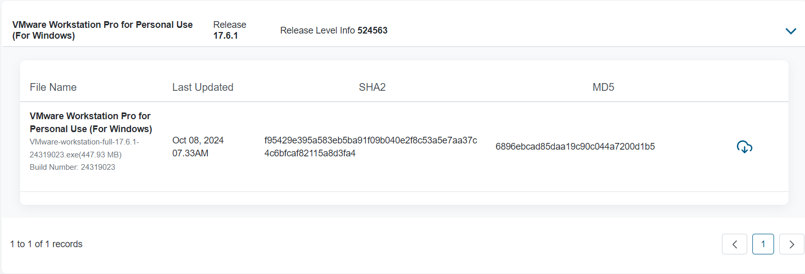
- Complete the installation, see the screenshots below.

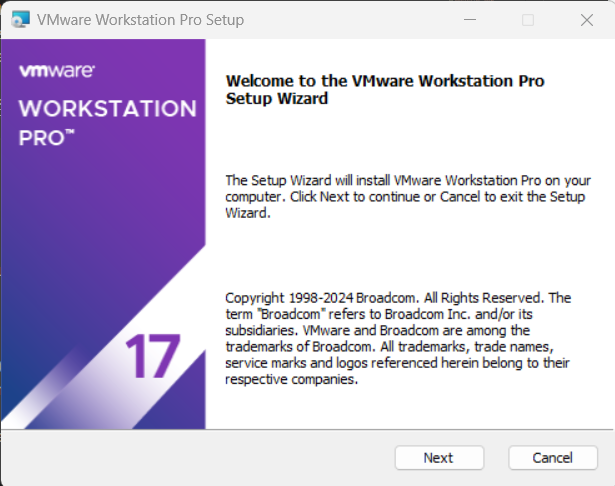
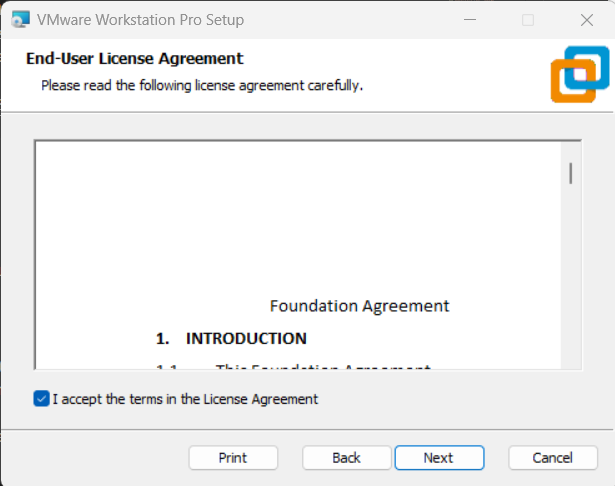

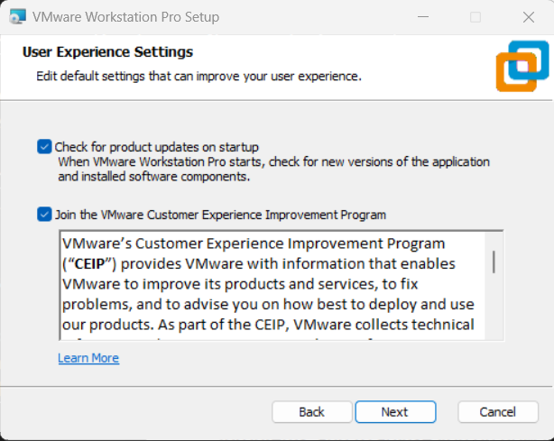
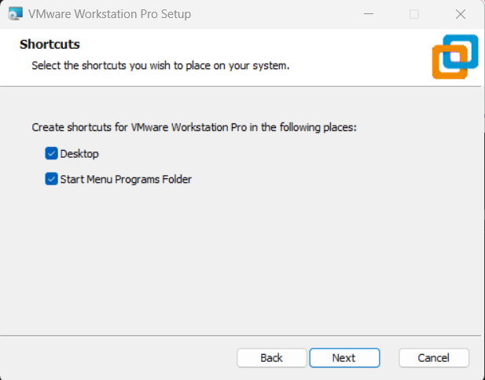
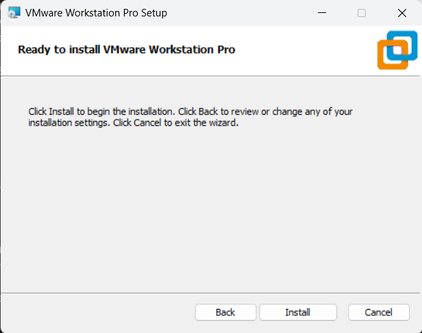
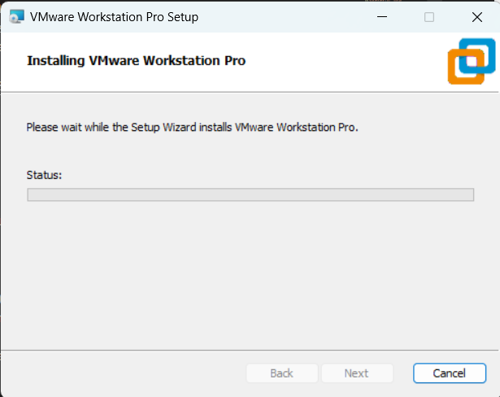
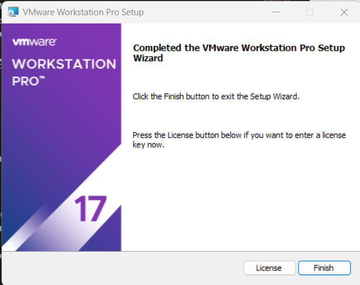


### Installation Setup

1. **Download Arch Linux ISO**  
Download the latest Arch Linux ISO from [archlinux.org](https://archlinux.org/download/). This installation uses archlinux.doridian.net.
    
**Description:** The ISO image contains the Arch Linux operating system files necessary for installation. Choosing a reliable source ensures the integrity and authenticity of the download.   
2. **Set Up VM**  
Use VMware to create a VM. Allocate at least 4GB of RAM and 20GB of disk space. See the steps below.
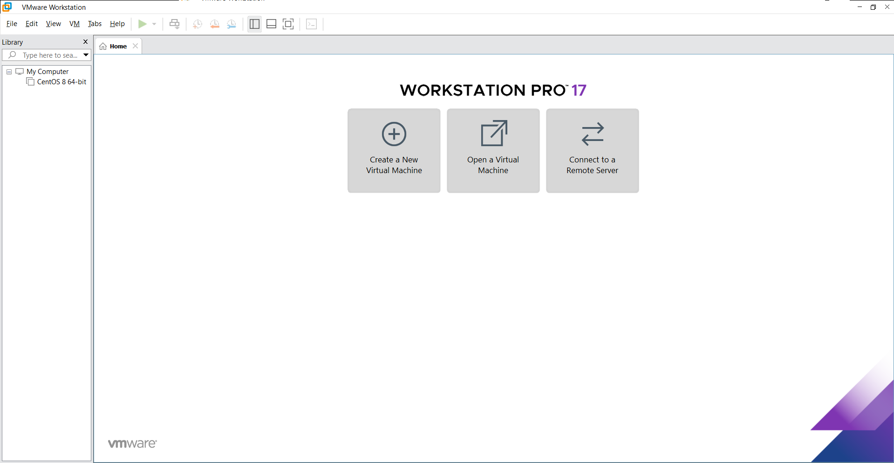
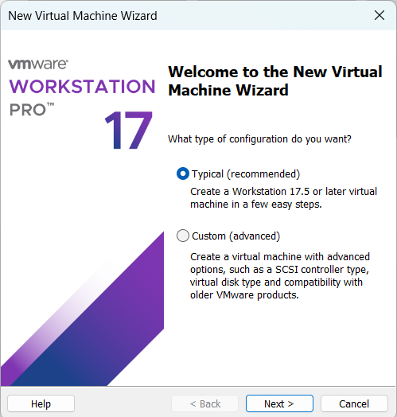
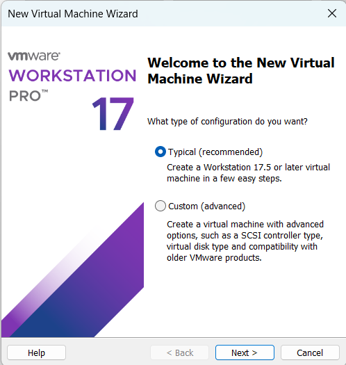
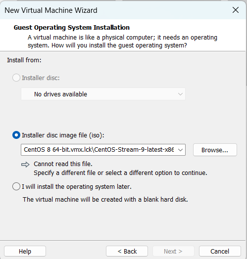
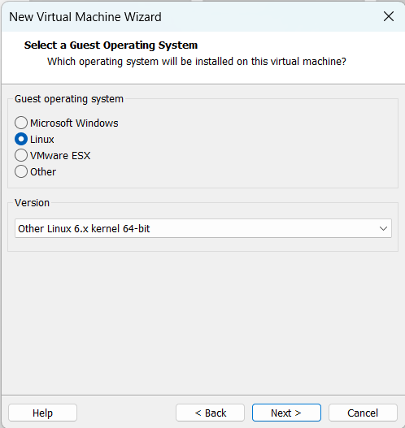
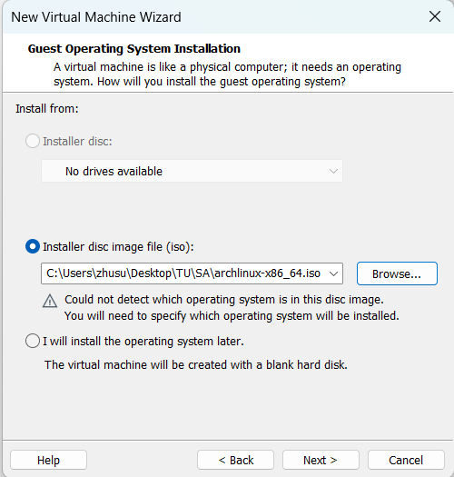
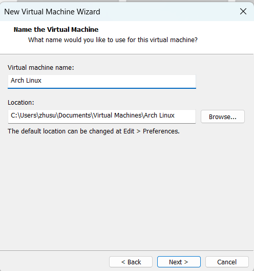
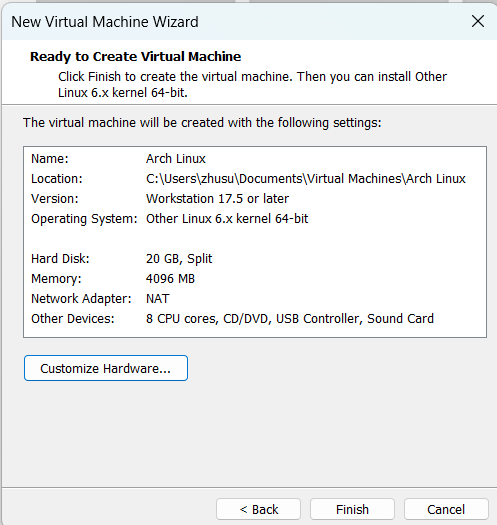

**Description:** Setting up a virtual machine (VM) allows you to run Arch Linux in an isolated environment. Sufficient RAM and disk space are essential for a smooth installation and performance of the OS.

3. **Boot into Arch ISO**  
Boot the VM using the downloaded ISO.
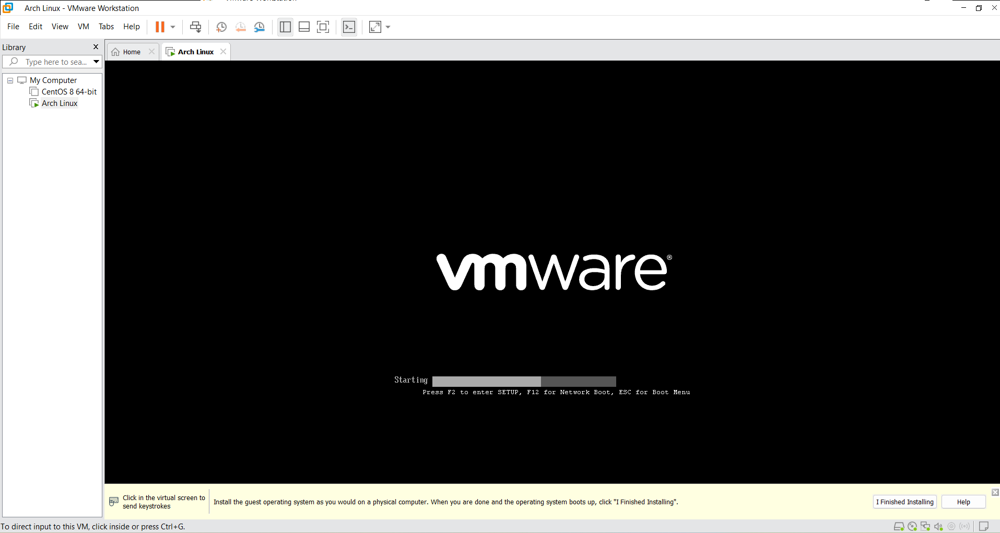
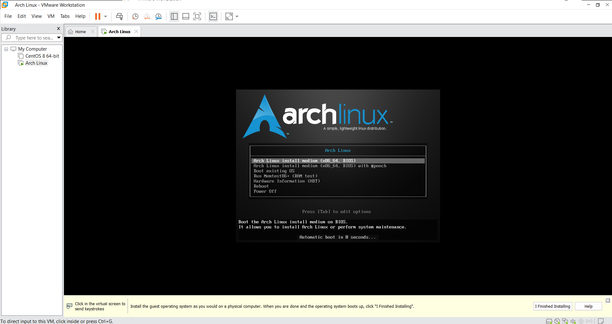
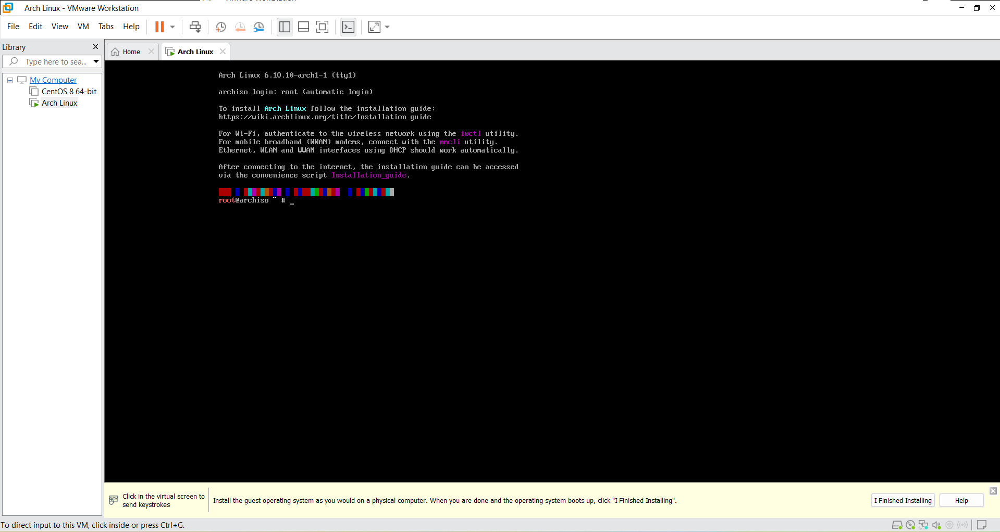

4. **Partition the Disk**  
Use `fdisk` or `cfdisk` to create partitions:
- `/dev/sda1` - 1G - for /boot
- `/dev/sda2` - 5G - for root
- `/dev/sda3` - 1G - for swap

  First, run the below command to find out the device identifier:
    ```bash
      fdisk -l
    ```

  **Description:** `fdisk -l` lists all disks and their partitions, allowing you to identify your target disk for partitioning.

  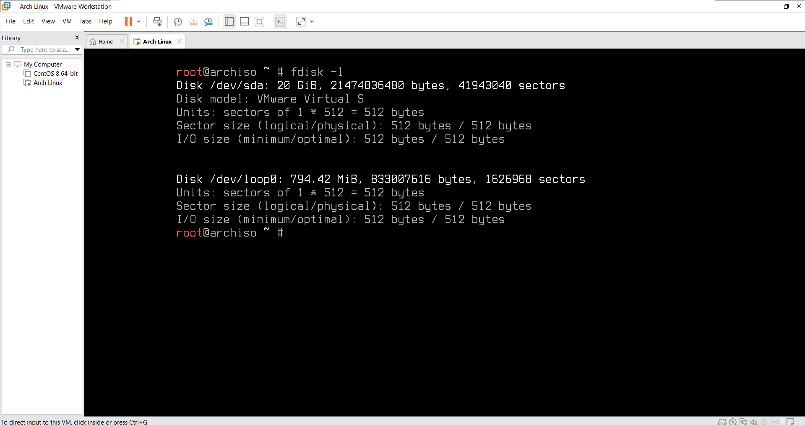

  Then, with the device identifier, run the below command to start partitioning your disk. Make sure to change `/dev/sda` as per your system.
  ```bash
    cfdisk /dev/sda
  ```

  **Description:** `cfdisk` is a command-line partitioning tool. This command opens the partitioning interface for the specified disk.

  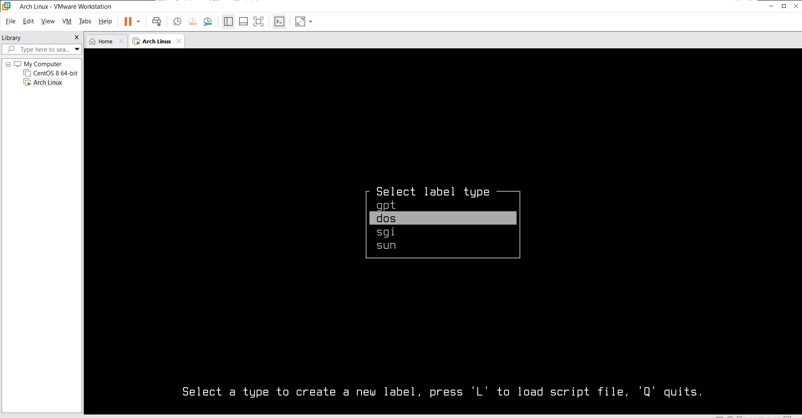

  Select `label type = dos` in the next prompt.
  
  Select the free space and choose option NEW from the bottom. 

  **Description:** Creating a new partition allows you to allocate space for the system, including boot, root, and swap partitions.

  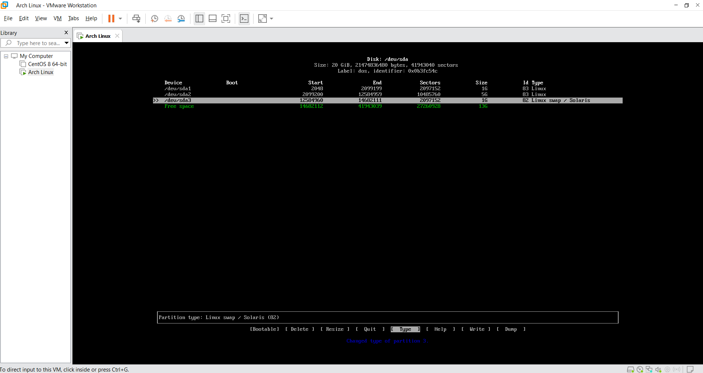

  Run the below command to check before you proceed to see in three partitions are listed.

  ```bash
    fdisk -l
  ```
  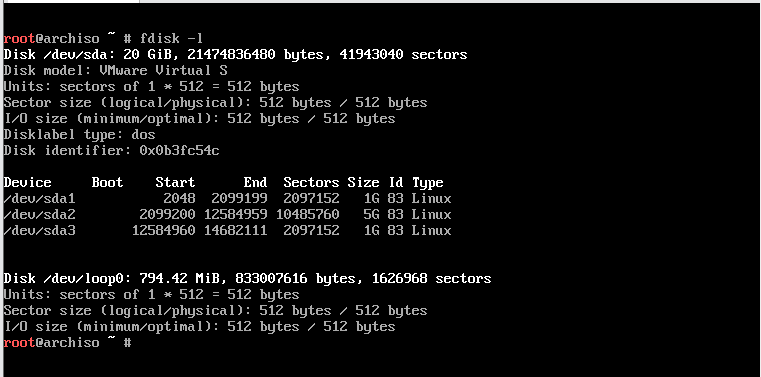

  Run the following commands in sequence to format and create an ext4 file system in the newly created partition above. Make sure you change the /dev/sda1 and /dev/sda2 as per your need.
  ```bash
    mkfs.fat -F32 /dev/sda1
    mkfs.ext4 /dev/sda2
    mount /dev/sda2 /mnt
    mkdir /mnt/boot
    mount /dev/sda1 /mnt/boot
  ```
  **Description:**
  - `mkfs.fat -F32 /dev/sda1`: Formats the `/boot` partition as FAT32, necessary for boot loaders.
  - `mkfs.ext4 /dev/sda2`: Formats the root partition as ext4, a widely used Linux filesystem.
  - `mount /dev/sda2 /mnt`: Mounts the root partition to `/mnt`, the temporary root directory during installation.
  - `mkdir /mnt/boot`: Creates a directory for the boot partition.
  - `mount /dev/sda1 /mnt/boot`: Mounts the boot partition, allowing the boot loader to store necessary files.


  After completion, mount the system and create the necessary directories.

  ```bash
    mount /dev/sda2 /mnt
    mkdir /mnt/boot /mnt/var /mnt/home
    mount /dev/sda1 /mnt/boot
  ```

  **Description:** This sets up the filesystem hierarchy by mounting partitions to specific directories for proper access during and after installation.

  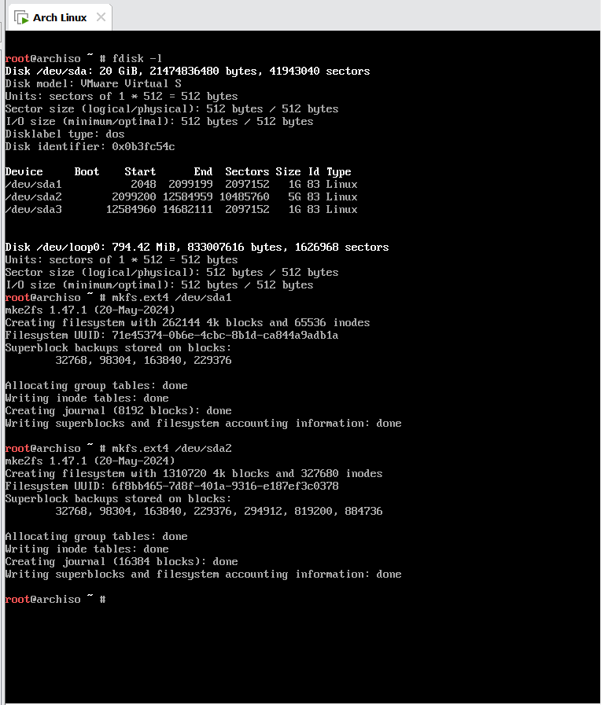

5. **Install Essential Packages**  
  Install base packages:
    ```bash
    pacman -Syy
    pacstrap /mnt base base-devel linux linux-firmware nano dhcpcd net-tools grub
    ```
    
    **Description:**
    - `pacman -Syy:` Updates the package database, ensuring the latest package information is used.
    - `pacstrap /mnt base base-devel linux linux-firmware nano dhcpcd net-tools grub`: Installs essential packages to the mounted filesystem:
    - base: Core system packages.
    - base-devel: Development tools.
    - linux: The Linux kernel.
    - linux-firmware: Firmware for hardware.
    - nano: A text editor for command-line use.
     - dhcpcd: DHCP client for automatic network configuration.
     - net-tools: Networking utilities.
     - grub: The bootloader to manage booting.

6. **Configure the System**  
  Generate fstab and configure hostname, timezone, and locale:
    ```bash
    genfstab -U /mnt >> /mnt/etcfstab
    arch-chroot /mnt
    ln -sf /usr/share/zoneinfoRegion/Chicago /etc/localtime
    hwclock --systohc
    echo "en_US.UTF-8 UTF-8" > etc/    locale.gen
    locale-gen
    echo "nuraiym" > /etchostname
    ```

    **Description:**
    - `genfstab -U /mnt >> /mnt/etc/fstab`: Generates the filesystem table, necessary for automatic mounting of partitions on boot
    - `arch-chroot /mnt`: Changes root into the newly installed system, allowing further configuration.
    - `ln -sf /usr/share/zoneinfo/Region/Chicago /etc/localtime`: Sets the timezone, which is important for accurate timekeeping.
    - `hwclock --systohc`: Syncs the hardware clock to the system clock.
    - `echo "en_US.UTF-8 UTF-8" > /etc/locale.gen`: Prepares the locale configuration for English (US).
    - `locale-gen`: Generates the locale data.
    - `echo "nuraiym" > /etc/hostname`: Sets the system's hostname, which identifies the machine on a network.

    The next step is to set up the root user password, create an admin user, and add the user to the sudoers file.

    Follow the below commands in sequence. Make sure to change the user name from debugpoint to something else as per your need.
    ```bash
    passwd root
    useradd -m -g users -G wheel -s /bin/bash nuraiym
    passwd nuraiym
    ```

    Open the sudoers file and add the below lines.

    ```bash
    nano /etc/sudoers
    ```

    Add below lines. As you already created the root user, the entry should be there.
    ```bash
    root ALL=(ALL) ALL
    nuraiym ALL=(ALL) ALL
    ```
7. **Install Bootloader**  
  Install grub, setup the initial ramdisk environment, unmount the system using the below commands in sequence.
    ```bash
    grub-install /dev/sda
    grub-mkconfig -o /boot/grub/grub.cfg
    mkinitcpio -p linux
    ```

    **Description:**
    - `grub-install /dev/sda`: Installs the GRUB bootloader to the specified disk, allowing the system to boot
    - `grub-mkconfig -o /boot/grub/grub.cfg`: Generates the GRUB configuration file, which defines boot options
    - `mkinitcpio -p linux`: Creates the initial ramdisk, which contains the necessary drivers and modules for booting.

    Then reboot the system.
    ```bash
    umount /mnt/boot
    umount /mnt
    reboot
    ```
8. **Install LXQt Desktop**   
  After reboot, choose Arch Linux from grub. In the Arch Linux prompt, start running the following commands in sequence. These commands install the Xorg server, display manager, LXQt desktop components, controller packages, and additional applications.

    For all the commands, use the default, i.e. press enter when asked.

   - Installs the Xorg server, which provides the graphical interface for the desktop environment.
   ```bash
   sudo pacman -S --needed xorg
   ```
   - Install display manager, lxqt desktop. Approx install size is 100 MB. Installs the LXQt desktop environment and dependencies, including the Simple Desktop Display Manager (SDDM).
   ```bash
   sudo pacman -S --needed lxqt xdg-utils ttf-freefont sddm
   ```
   - Install additional components (approx 80 MB)
   ```bash
   sudo pacman -S --needed libpulse libstatgrab libsysstat lm_sensors network-manager-applet oxygen-icons pavucontrol-qt
   ```
   - Install applications
   ```bash
   sudo pacman -S --needed firefox vlc filezilla leafpad xscreensaver archlinux-wallpaper
   ```
   - Now it’s time to enable the display manager and network manager as a service. So that, the next time you log on, they can run automatically by systemd.
   ```bash
   systemctl enable sddm
   systemctl enable NetworkManager
   ```
   - Reboot the system using the reboot command.
   ```bash
   reboot
   ```

  Now you can log in using the user id and password which you just created.

  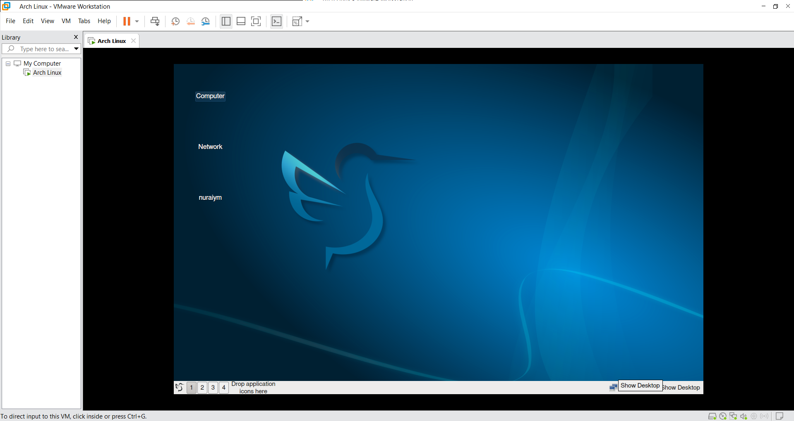


**Note:** If some of the commands are not working, you may need to put sudo before running it.


## User Accounts
1. Create User Account
  
    Add user accounts for justin, and codi:
   ```bash 
   useradd -m -G users -s /bin/  bash  justin
   useradd -m -G users -s /bin/  bash  codi
   ```
    User account for *nuraiym* was created in previous section.
2. Set Passwords

    Assign passwords to users and enforce a password change on the first login:
    ```bash 
    passwd justin #Type GraceHopper1906
    passwd codi #Type GraceHopper1906
    chage -d 0 justin
    chage -d 0 codi
    ```

    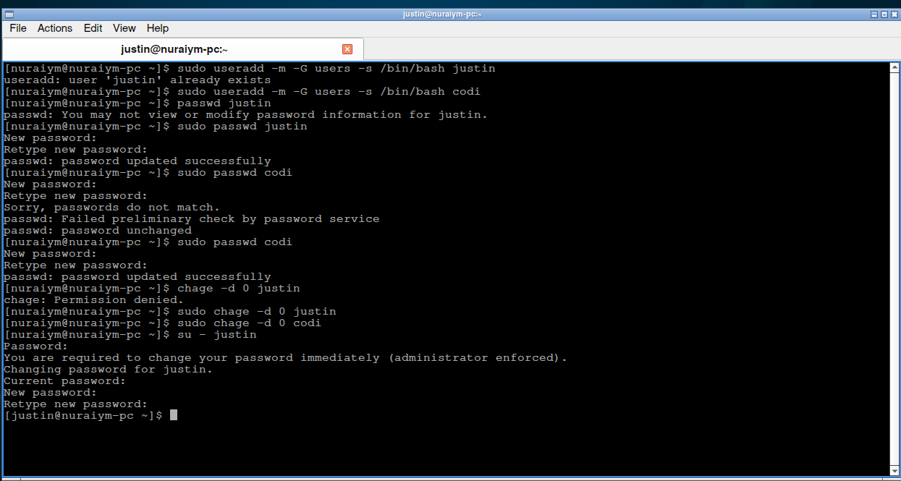
3. Configure sudo

    Edit the sudoers file to grant sudo permissions:
    Open the sudoers file and add the below lines.

      ```bash
      nano /etc/sudoers
      ```

      Add below lines. As you already created the root user, the entry should be there.
      ```bash
      root ALL=(ALL) ALL
      nuraiym ALL=(ALL) ALL
      justin ALL=(ALL) ALL
      codi ALL=(ALL) ALL
      ```

      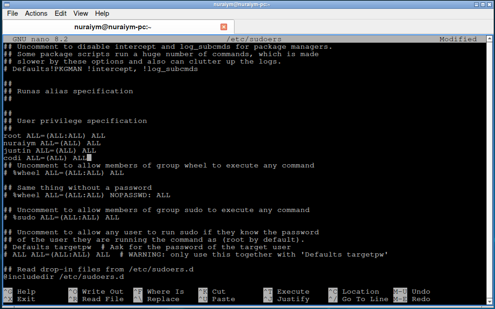

## Desktop Environment
1. Enable the Display Manager
   Enable LightDM as the display manager:
    ```bash 
    pacman -S lightdm lightdm-gtk-greeter
    systemctl enable lightdm
    ```
2. **Reboot**
  
  Reboot the system to verify the installation:
    ```bash 
    reboot
    ```

## Install different shells zsh or fish.
1. **Install a fish**

    Install and configure fish:
    ```bash 
    sudo pacman -S fish
    chsh -s /bin/fish nuraiym
    ```

      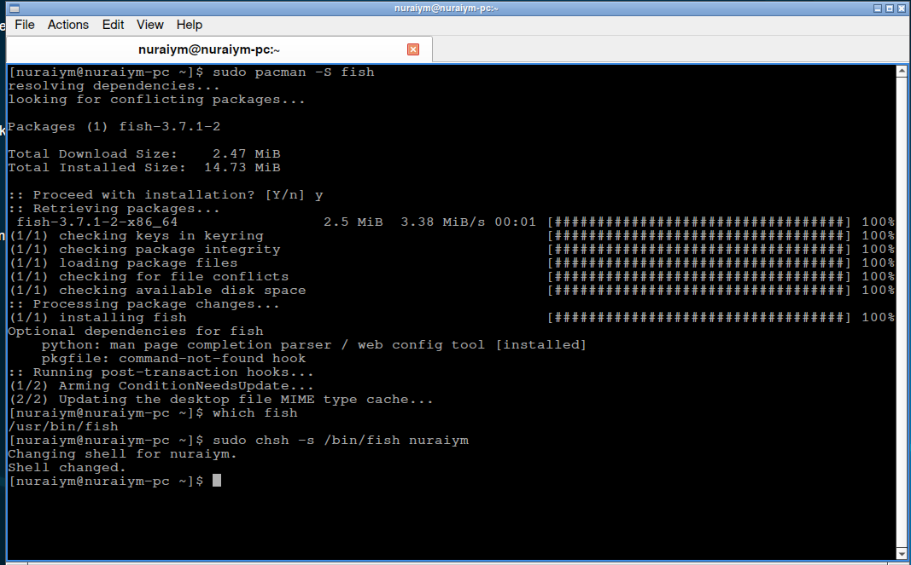

2. **Install a zsh**
   
    Install and configure zsh:
    ```bash 
    pacman -S zsh
    chsh -s /bin/zsh nuraiym
    ```

      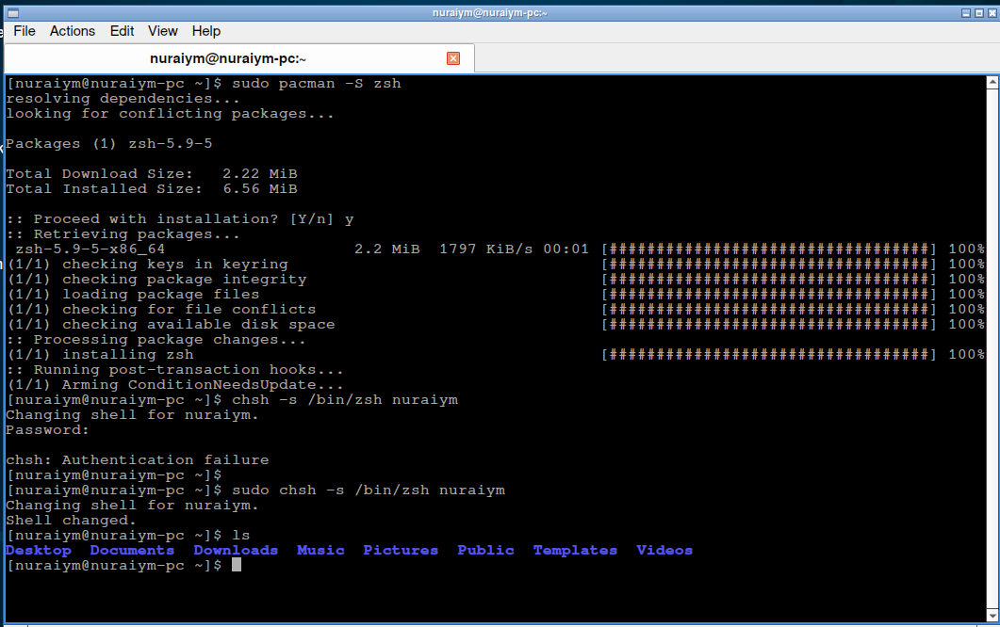


## Install and Configure SSH
  Install SSH and start it at boot
  ```bash 
  pacman -S openssh
  systemctl enable sshd
  systemctl start sshd
  ```
  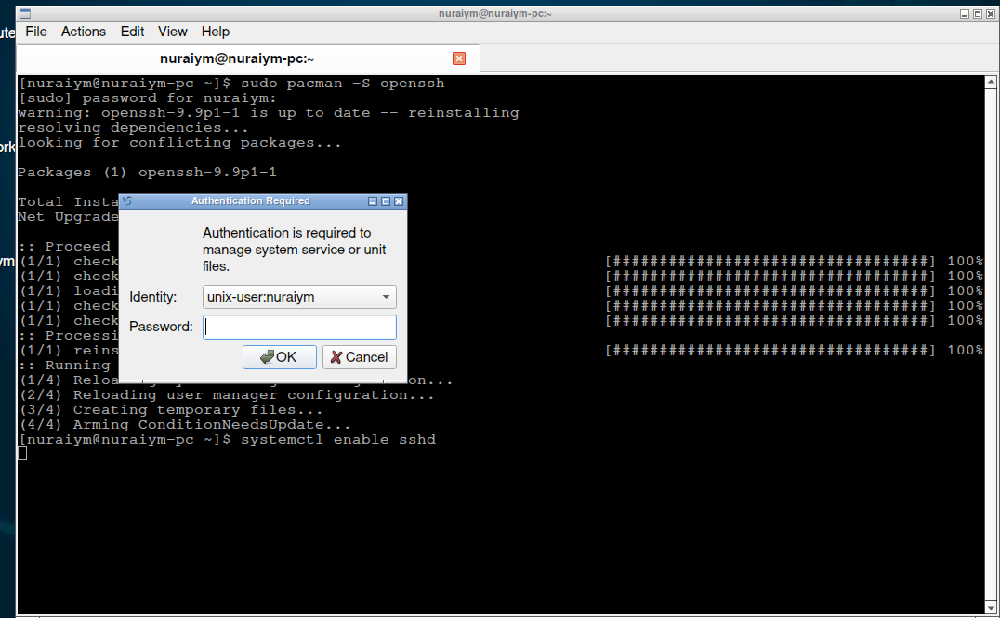
  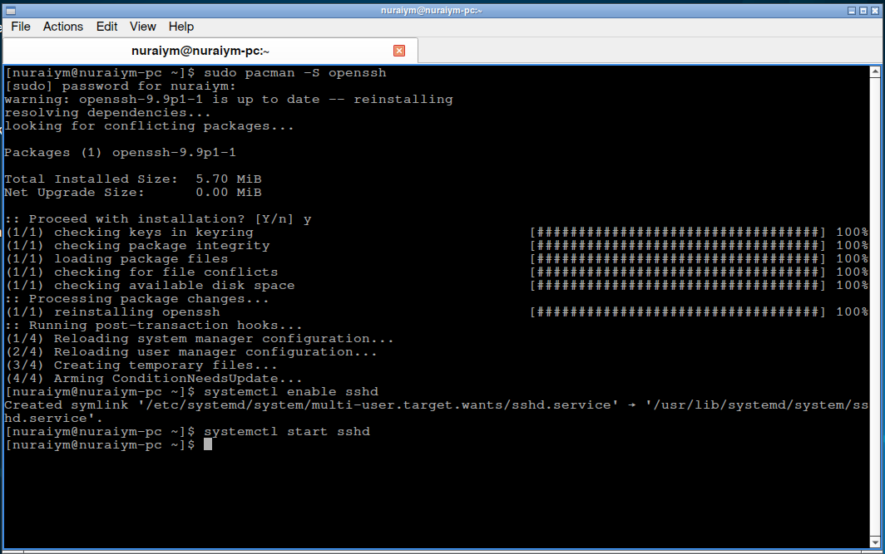
      
## Set Up Aliases
Add custom aliases to `.zshrc` or `.bashrc`:
  1. **Edit shell configuration file:** 
     - For Bash, edit `.bashrc` :
        ```bash 
        sudo nano ~/.bashrc
        ``` 
     - For Zsh, edit `.zshrc`:
       ```bash 
       sudo nano ~/.zshrc
       ``` 
  2. **Add aliases:**
      ```bash 
      alias update='sudo pacman -Syu'   # Update the system
      alias cls='clear'                 # Clear the terminal
      alias ..='cd ..'                  # Go up one directory
      alias ll='ls -lh'                 # List files with details
      ``` 
  3. **Reload the configuration file to apply the changes:**
     - For Bash:
        ```bash 
        sudo source ~/.bashrc
        ``` 
     - For Zsh:
       ```bash 
       source ~/.zshrc
       ```  
  4. **Add aliases from web page if the internet connection established and curl is installed**      
     - For Bash: get the raw - data from github page and append it to `.bashrc`
        ```bash 
        sudo wget -qO- https://raw.githubusercontent.com/username/repository/branch/filename >> ~/.bashrc

        ``` 

## Enable Terminal Colors
To enable color coding in the terminal like the Arch ISO installation process, follow these steps:
   1. **Bash**
        - Edit the `.bashrc` file to enable color support
          ```bash 
          sudo nano ~/.bashrc
          ```
        - Add or uncomment the following lines to enable colored output (enable color for ls and grep)::
          ```bash 
          alias ls='ls --color=auto'
          alias grep='grep --color=auto'
          ```
        - Save and close the file, then reload `.bashrc`
          ```bash 
          sudo source ~/.bashrc
          ```
   2. **Zsh**
        - Edit the `.zshrc` file:
          ```bash 
          sudo nano ~/.zshrc
          ```
        - Add the following lines to enable colored output (enable color for ls and grep):
          ```bash 
          alias ls='ls --color=auto'
          alias grep='grep --color=auto'
          ```
        - Save and close the file, then reload `.zshrc`
          ```bash 
          sudo source ~/.zshrc
          ```

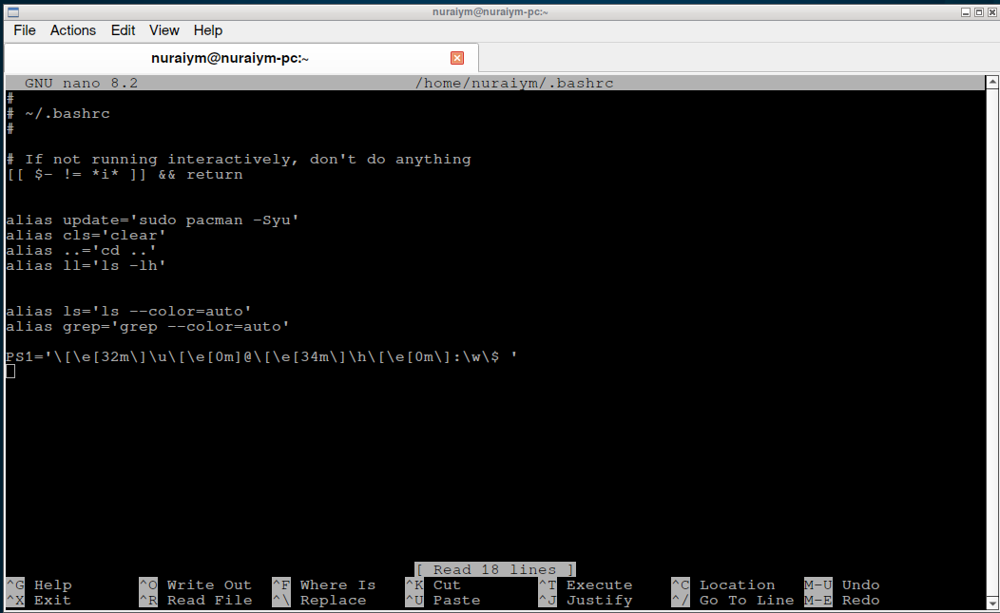
<p>.bashrc-File</p>

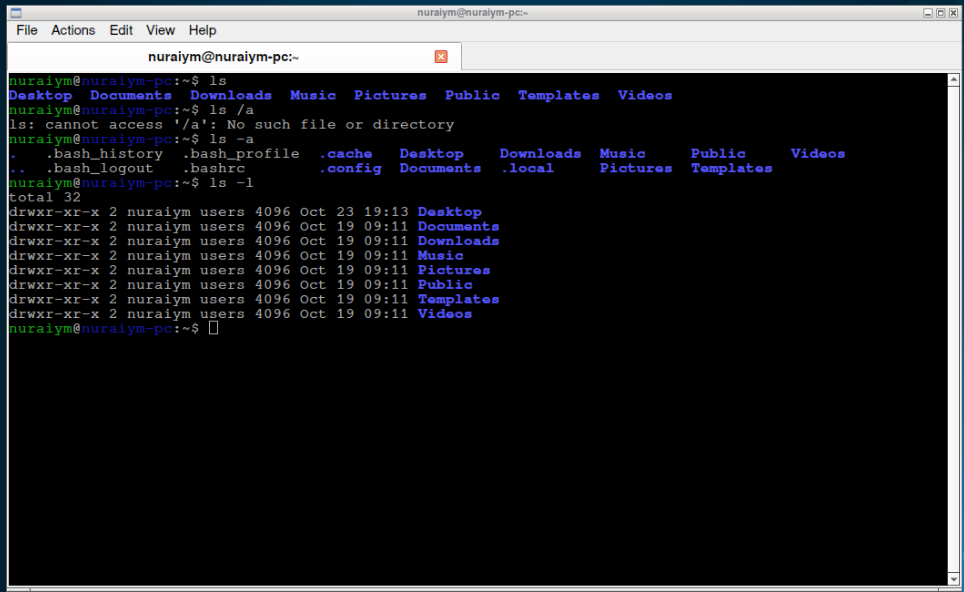
<p>Terminal after changing the colors and setting the aliases</p>


## Troubleshooting 
When running the pacman -Syy command, I got errors "failed retrieving file 'core.db' from mirrors.lty.org". This occured due to issues with the configured mirrors, which are the servers from which pacman downloads packages and updates. If the mirrors are outdated, unreachable, or experiencing downtime, pacman won't be able to fetch the necessary database files, leading to synchronization failures.
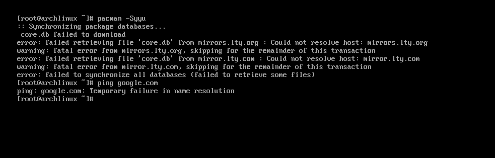
  ### Solution: Edit `/etc/resolv.conf`
  To address potential DNS resolution failures, you can edit the `/etc/resolv.conf` file to ensure that your system can resolve domain names properly.
  ### Steps to Edit `/etc/resolv.conf`:

1. **Open the Terminal.**
2. **Edit the `resolv.conf` file** using a text editor, such as `nano`:

   ```bash
   sudo nano /etc/resolv.conf
   ```
3. **Add or update the following**  to use Google’s DNS servers:  
   ```bash
   nameserver 8.8.8.8
   nameserver 8.8.4.4
   ```
   This configuration directs the system to use Google's public DNS servers, which are generally reliable and fast.
4. Save the file and restart  network service:
      ```bash
      sudo systemctl restart NetworkManager
      ```
5. Reboot the server
      ```bash
      reboot
      ```
6. Test 
      ```bash
      ping -c 4 google.com
      sudo pacman -Syy
      ```
## References
- [Arch Linux Installation Wiki](https://wiki.archlinux.org/title/Installation_guide)
- [Arch User Repository (AUR)](https://aur.archlinux.org/)
- [ChatGPT](https://chatgpt.com/)