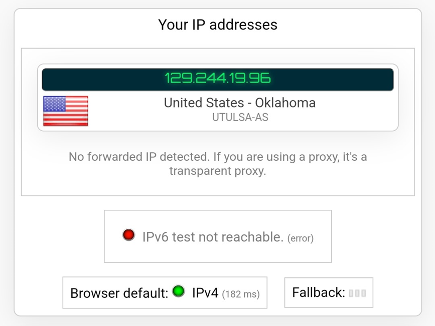
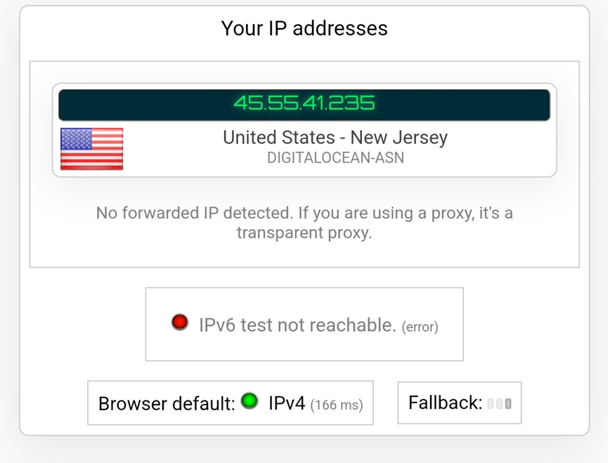
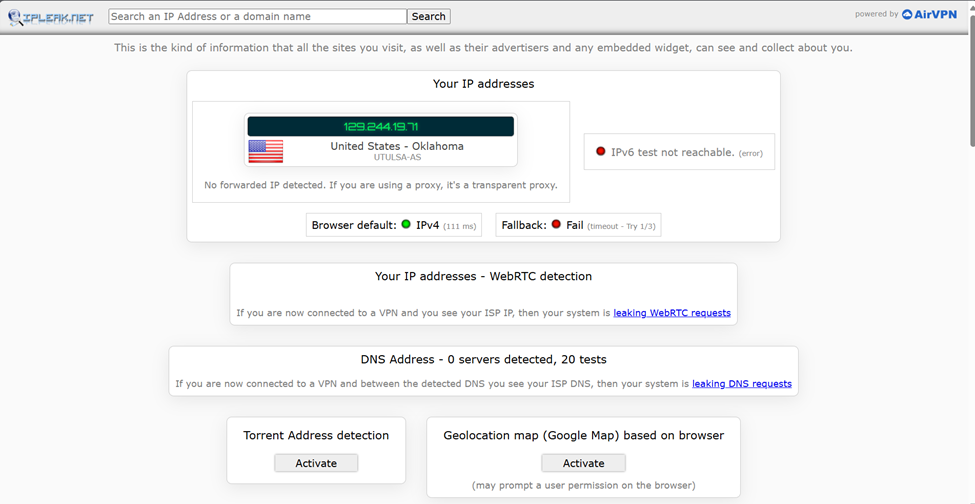
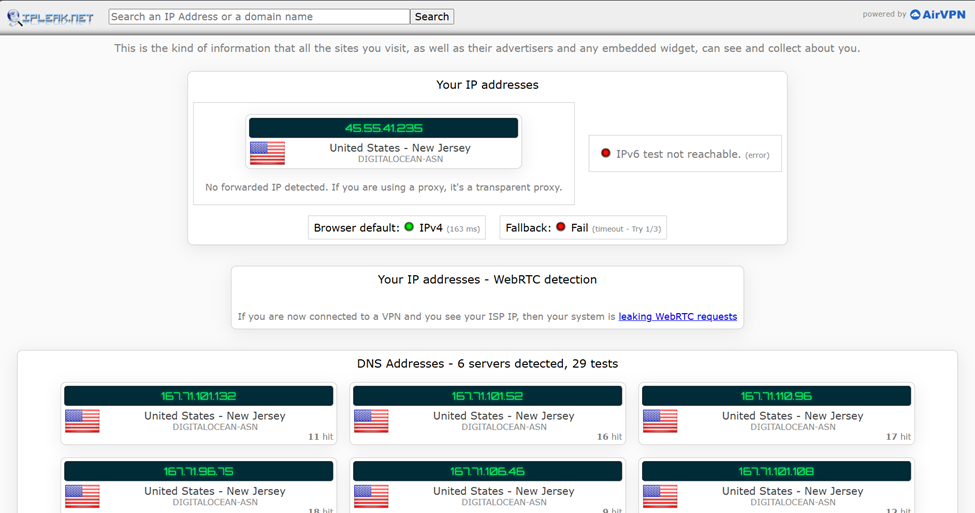

# Wireguard Setup with Docker-compose and Digital Ocean

## Table of Contents
- [Assignment Instructions](#assignment-instructions)
- [Table of Contents](#table-of-contents)
- [Installation Process](#installation-process)
- [Create an Ubuntu 22.04](#create-an-ubuntu-2204)
- [Update and Upgrade](#update-and-upgrade)
- [Install Docker and Docker-Compose](#install-docker-and-docker-compose)
- [Setup folders and create .yml](#setup-folders-and-create-yml)
    - [Setup Wireguard in Docker-compose.yml](#setup-wireguard-in-docker-composeyml)
    - [Description of Docker Compose File Configuration](#description-of-docker-compose-file-configuration)
- [Testing the VPN](#testing-the-vpn) 
    - [Configure and test VPN access on](#configure-and-test-vpn-access-on)
        - [Mobile device](#mobile-device) 
        - [Laptop](#laptop) 
- [References](#references)

## Installation Process
1. Sign up for a **new** account using this URL [https://m.do.co/c/d33d59113ab6](#https://m.do.co/c/d33d59113ab6)
• Gets you $200 credit for 2 months of usage
### Create an Ubuntu 22.04
1. 2nd Cheapest Droplet = $6/mont
    - Ubuntu 22.04
    - Basic
    - Regular Intel CPU
    - Normal SSD
2. Choose either SSH key or Password
3. Open the terminal and connect to the ubuntu-server using the following command
```bash 
ssh root@[ip-address]
```
*ip-address* - should be shown on the droplet.
## Update and Upgrade
After connecting use the following command
```bash 
sudo apt update && sudo apt upgrade -y
```
## Install Docker and Docker-Compose
```bash 
sudo apt install docker.io docker-compose -y
```
## Setup folders and create .yml
Create directories for WireGuard configuration:
```bash 
mkdir -p ~/wireguard/
mkdir -p ~/wireguard/config/
```
Creates the necessary directory structure for the WireGuard service.
### Setup Wireguard in Docker-compose.yml
Edit the Docker Compose file:
```bash 
sudo nano ~/wireguard/docker-compose.yml
```
Copy the following content in docker-compose.yml file:
```bash
version: '3.8'
services:
  wireguard:
    container_name: wireguard
    image: linuxserver/wireguard
    environment:
      - PUID=1000
      - PGID=1000
      - TZ=Etc/UTC
      - SERVERURL=1.2.3.4
      - SERVERPORT=52820
      - PEERS=pc1,phone1
      - PEERDNS=auto
      - INTERNAL_SUBNET=10.0.0.0
    ports:
      - 52820:52820/udp
    volumes:
      - type: bind
        source: ./config/
        target: /config/
      - type: bind
        source: /lib/modules
        target: /lib/modules
    restart: always
    cap_add:
      - NET_ADMIN
      - SYS_MODULE
    sysctls:
      - net.ipv4.conf.all.src_valid_mark=1
```
### Description of Docker Compose File Configuration
#### **`container_name`**
- Names the container `wireguard` for easier management.

#### **`image`**
- Uses the `linuxserver/wireguard` Docker image.

#### **`environment`**
- Sets environment variables for container customization:
  - **`PUID` and `PGID`:** Set to `1000` for the user's default UID and GID.
  - **`TZ`:** Specifies the timezone (set to `Etc/UTC`).
  - **`SERVERURL`:** Public IP or domain of the WireGuard server (replace `1.2.3.4`).
  - **`SERVERPORT`:** Port for the WireGuard service (`52820`).
  - **`PEERS`:** List of client peers (e.g., `pc1`, `phone1`).
  - **`PEERDNS`:** Sets DNS resolution for peers (use `auto`).
  - **`INTERNAL_SUBNET`:** Defines the internal VPN subnet (e.g., `10.0.0.0`).


#### **Ports**
- Maps port `52820` on the host to `52820/udp` in the container.


#### **Volumes**
- **`/config`:**
  - Binds the local `./config/` folder to the container's `/config/` for persistent data.
- **`/lib/modules`:**
  - Binds the host's `/lib/modules` for kernel module access.


#### **Restart Policy**
- Automatically restarts the container if it stops.


#### **Capabilities and System Controls**
- **`cap_add`:**
  - Grants the container network management (`NET_ADMIN`) and kernel module loading (`SYS_MODULE`) capabilities.
- **`sysctls`:**
  - Configures network settings (`net.ipv4.conf.all.src_valid_mark=1`).
## Testing the VPN
Start the WireGuard container:
```bash
cd ~/wireguard/
docker-compose up -d
```
Brings up the container in detached mode (-d).
Check logs to get the QR code: 
```bash
docker-compose logs -f wireguard
```
### Configure and test VPN access on
- Mobile device: Import the peer configuration and test connectivity.
- Laptop: Set up the VPN connection and verify proper routing.
#### Mobile device
1.	Open the Wireguard app and scan the QR code from the logs. 
2.	Before connecting: 
    - Visit [IPLeak.net](https://ipleak.net/) and screenshot your local IP. The following screenshot shows the IP-Address:
     
3.	After connecting: 
    - Turn on the Wireguard VPN and revisit [IPLeak.net](https://ipleak.net/)
    - Screenshot of the VPN IP is shown below: 
     

#### Laptop 
1. Setting Up the WireGuard Client for Ubuntu
    ```bash 
    sudo apt update
    sudo apt install wireguard
    ```
2. Locate the WireGuard Configuration File
    
    To find the configuration file:
    ```bash
    ls /opt/wireguard/config
    ```
3. Copy the Configuration File to Your Client
    ```bash
    scp root@[ip-address]:/opt/wireguard/config/peer_pc1.conf ~/peer_pc1.conf
    ```
    or put the following content in ```~/peer_pc1.conf```
    ```bash
    [Interface]
    PrivateKey = iLwC8xbCzwVd5j9s7Et/72d6keAAVTlkmxcY/wX6Ako=
    ListenPort = 52820
    Address = 10.0.0.2/32
    DNS = 10.0.0.1

    [Peer]
    PublicKey = P5GnsQQZk4X0KilGkKNg5ND/XZjV0KP7QDNuShSCcG4=
    PresharedKey = 5X6AWptfcPEHqhgi3nVlEb6vx833rLQic/ofI4TMy5s=
    AllowedIPs = 0.0.0.0/0, ::/0
    Endpoint = 45.55.41.235:52820
    ```
4.  Import the Configuration File into WireGuard

    Use the WireGuard CLI:

    ```bash 
    sudo wg-quick up ~/wireguard-client.conf
    ```
    To bring the interface down, use:
    ```bash 
    sudo wg-quick down ~/wireguard-client.conf
    ```
5. Verify the VPN Connection
    Check WireGuard status-  to verify that the VPN interface is up and running, use the following command:
    ```bash 
    sudo wg
    ```
6. Check IP address
    - Before connecting to the VPN - Go to [IPLeak.net](https://ipleak.net/) or run curl ifconfig.me in the terminal to see your current public IP.
     
    - After connecting to the VPN - Visit [IPLeak.net](https://ipleak.net/)again or run curl ifconfig.me to confirm that your IP has changed to the VPN server’s IP address.
     


## References
- [Setup Wireguard VPN server with Docker](https://thematrix.dev/setup-wireguard-vpn-server-with-docker/)