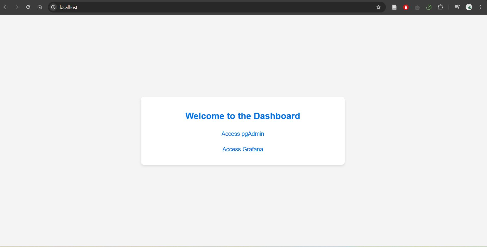
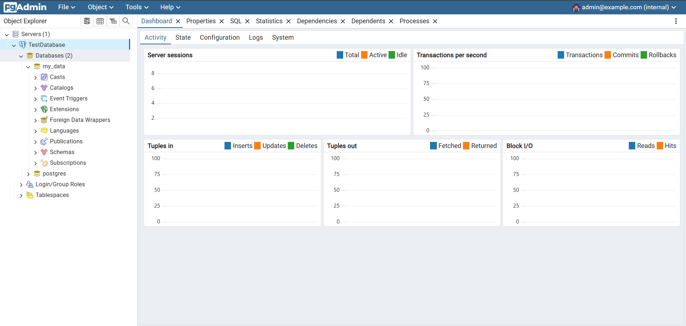
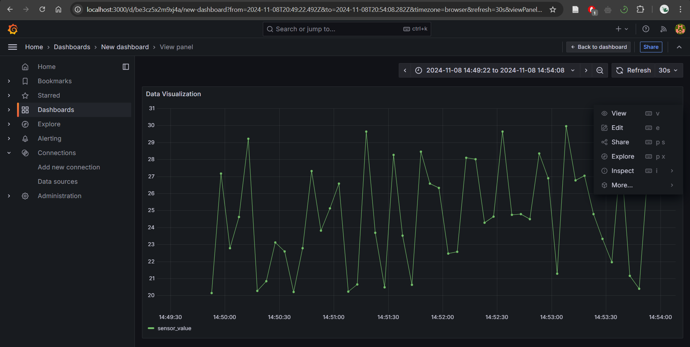
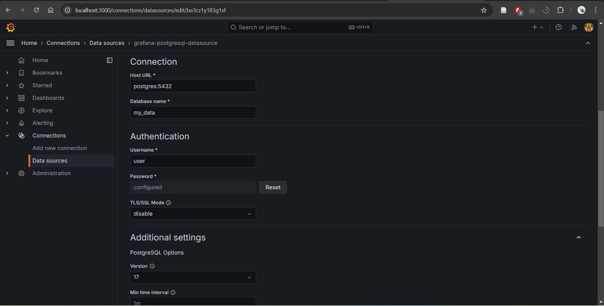
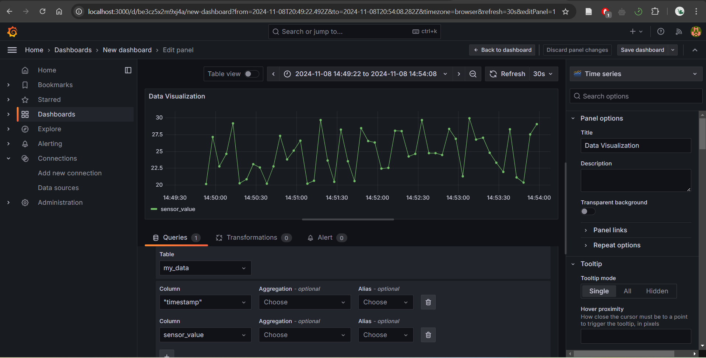
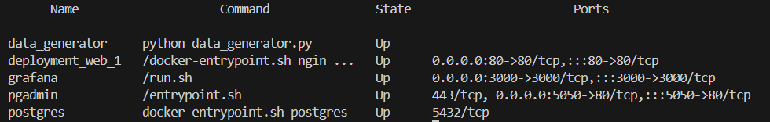

# Docker installation

## Table of Contents
- [Assignment Instructions](#assignment-instructions)
- [Table of Contents](#table-of-contents)
- [System Prerequisites](#system-prerequisites)
- [Deployment description](#deployment-description)
    - [Functional requirenments](#functional-requirenments)
    - [Additional features](#additional-features)
- [Installing docker and docker-compose](#installing-docker-and-docker-compose)
- [Setup](#setup)
    - [Folder structure](#folder-structure)
    - [Setup Docker-Compore File](#setup-docker-compore-file)
        - [Setup python](#setup-python)
        - [Setup Nginx and web](#setup-nginx-and-web)
        - [Setup postgres](#setup-postgres)
        - [Setup grafana](#setup-grafana)
        - [Setup pgadmin](#setup-pgadmin)

    - [Additional Configurations](#additional-configurations)
- [Running deployment](#running-deployment)
- [Troubleshooting](#troubleshooting)
- [References](#references)

## System Prerequisites
This project is deployed in Ubuntu 22.04 using WSL in Windows (see [How to install Linux on Windows using WSL](https://learn.microsoft.com/en-us/windows/wsl/install)). Make sure everything is installed before you start building the project. 

## Deployment description
This Docker Compose setup defines a multi-service environment consisting of a web server, PostgreSQL database, Grafana, pgAdmin, and a Python-based data generator. The deployment ensures the following services are integrated and properly configured:

- **Web Service (nginx)**:

    Purpose: Acts as the reverse proxy for the web traffic.

    Configuration: Built from a local nginx context and exposes port 80 to the host machine.

    Dependencies: Relies on both grafana and pgadmin services for integration.
- **PostgreSQL Database (postgres)**:

    Purpose: A relational database to store sensor data generated by the Python service.

    Configuration: Uses the postgres:latest image with custom credentials (POSTGRES_USER, POSTGRES_PASSWORD, POSTGRES_DB). 
    Data is stored persistently through a volume postgres_data.

    Networking: The database is part of the backend network, making it accessible to other services.
- **Grafana**:

    Purpose: Provides a data visualization platform to analyze and visualize the data stored in PostgreSQL.

    Configuration: Uses the grafana/grafana:latest image with custom environment variables to disable OAuth login, set PostgreSQL as the default data source, and configure connection details to the PostgreSQL container.

    Dependencies: Relies on postgres for data.

    Ports: Exposes port 3000 for accessing Grafana's web interface.

- **pgAdmin**:

    Purpose: A web-based administration tool for managing the PostgreSQL database.

    Configuration: Uses the dpage/pgadmin4:latest image, with a default email and password for login. The pgadmin_data volume ensures persistence of configuration data.

    Ports: Exposes port 5050 for accessing pgAdmin's web interface.

    Dependencies: Relies on postgres for database management.
- **Python Data Generator**:

    Purpose: Generates sensor data and inserts it into the PostgreSQL database.
    
    Configuration: Built from a local python context. The service connects to the PostgreSQL database using environment variables (DB_HOST, DB_NAME, DB_USER, DB_PASSWORD).

- **Networking**:
    All services are connected via the backend network, which uses the bridge driver to facilitate communication between containers.

- **Volumes**:
    Persistent data storage is provided for each service:

    postgres_data: Stores PostgreSQL data.

    grafana_data: Stores Grafana data, including dashboards and configuration.

    pgadmin_data: Stores pgAdmin's configuration data.
- **Dependencies**:
    web depends on grafana and pgadmin.

    grafana and pgadmin depend on postgres.

    python depends on postgres.

This deployment facilitates seamless interaction between the web interface, data generation, database storage, and visualization tools, creating an integrated data management system.

## Installing docker and docker-compose
Install docker and docker-compose. Use the following commands:
```bash 
sudo apt-get update && sudo apt-get install -y docker.io docker-compose
```
Make sure docker is installed:
```bash 
sudo docker --version
```
Something like this
```bash 
Docker version 24.0.7
```
should be printed.

## Setup
This section explains step by step for what is each file or folder in the directory *deploymnet*.
### Folder structure
The following is the folder structure of the deployment:
```bash
.
├── docker-compose.yml
├── nginx
│   ├── Dockerfile
│   └── index.html
└── python
    ├── Dockerfile
    └── data_generator.py
```   
Later, make sure you are running docker-compose in this derectory.

- *docker-compose.yml*: Defines and orchestrates all services (Nginx, Python, PostgreSQL, Grafana, pgAdmin), including their dependencies, networks, and volumes.
- *nginx/Dockerfile*: Builds the Nginx container, copying the *index.html* file and configuring Nginx to serve the web content.
- *nginx/index.html*: Serves as the web page with links or dashboard to access services like Grafana and pgAdmin.
- *nginx/resources/img*: Contains resources for the custom HTML Page.
- *python/Dockerfile*: Builds the Python container, installs dependencies, and sets up the environment to run the sensor data generator script.
- *python/data_generator.py*: Generates and inserts simulated sensor data into PostgreSQL at regular intervals.

### Setup Docker-Compore File
Here’s a detailed description of each configuration in Docker Compose setup:
#### Setup python
- **Purpose:** The Python service is responsible for generating sensor data that will be stored in PostgreSQL.
- **Configuration:**
    - Builds from the *./python* directory, ensuring the Python code is packaged within the container.
    - The environment variables *DB_HOST*, *DB_NAME*, *DB_USER*, and *DB_PASSWORD* are set to connect to the PostgreSQL container (*postgres*).
    - The *depends_on* configuration ensures the Python container starts after PostgreSQL is up and running.
    - It uses the *backend* network to communicate with the other services.
#### Setup Nginx and web
- **Purpose:** The *web* service is responsible for serving your custom HTML page, which includes links to *Pgadmin* and *Grafana*.
- **Configuration:**
    - Nginx is built from the *./nginx* directory, meaning custom configurations (such as reverse proxies or routing rules) can be added to Nginx.    
    - Exposes port *80* on the host, allowing external access to your web service.
    - This service depends on Grafana and pgAdmin being up to ensure those applications are accessible via the web page.
#### Setup postgres
- **Purpose:** The PostgreSQL service holds the sensor data generated by the Python container.
- **Configuration:**
    - Uses the official *postgres* image and defines default environment variables for user, password, and database name.
    - The *postgres_data* volume ensures data persists even if the container is restarted.
    - Configured to be part of the *backend* network, allowing secure communication with other services.
#### Setup grafana
- **Purpose:** Grafana is used for visualizing the sensor data stored in PostgreSQL.
- **Configuration:**
    - The service uses the *grafana/grafana* image and sets up essential configurations, including the admin user, password, and the default data source (PostgreSQL).
    - The *GF_DATASOURCE_** environment variables connect Grafana to the PostgreSQL container using its service name (postgres) and credentials.
    - The *depends_on* ensures that Grafana starts after PostgreSQL is available.
    - The volume *grafana_data* ensures Grafana's configuration and data are persistent across container restarts.
#### Setup pgadmin
- **Purpose:** pgAdmin provides a web interface for managing and querying PostgreSQL databases.
- **Configuration:**
    - Uses the* dpage/pgadmin4* image and sets up the default login credentials.
    - Exposes port *5050* to allow access to the pgAdmin interface via the web.
    - Also depends on PostgreSQL to be up before starting, ensuring it can interact with the database.
    - A persistent volume *pgadmin_data* ensures that pgAdmin’s configuration persists across restarts.
#### Additional Configurations
- **Networks:** All services are connected through a *bridge* network named *backend*. This isolates the communication between services to this network, ensuring better security and performance.
- **Volumes:**
Three volumes are defined (*postgres_data*, *grafana_data*, *pgadmin_data*) to store persistent data for PostgreSQL, Grafana, and pgAdmin. This ensures that important data is retained even if the containers are removed or restarted.

## Running deployment
1. Clone the Repository, navigate to the deployment directory and start the containers:
    ```bash 
    git clone https://github.com/zhusupbekovan/zhusupbekovan.github.io.git
    cd Docker/deployment
    sudo docker-compose up -d
    ```
    - The *-d* flag starts the services in detached mode, meaning they will run in the background.
    - *sudo docker-compose up -d* will start:

        - Nginx (Web service for front-end or main page)
        - PostgreSQL (Database container for storing data)
        - Grafana (Analytics and monitoring tool)
        - pgAdmin (Web-based PostgreSQL administration tool)
        - Python (A containerized Python script for generating data for PostgreSQL database)
2. Access the Services
    - **Nginx Web Service (Main Page)**: Open browser and go to http://localhost. This should load the index page served by Nginx. Webpage should also contain links to *pgAdmin* and *grafana*. 
    
    - **pgAdmin**: You can access pgAdmin at http://localhost:5050. Log in using the credentials specified in the docker-compose.yml:
        - Email: admin@example.com
        - Password: admin
            
    - **Grafana:** Open browser and navigate to http://localhost:3000. You can log in using the default credentials:
        - Username: admin
        - Password: admin
         
3. Configuring the Dashboard in Grafana
    - Add PostgreSQL as a Data Source
        1. Go to the left-hand menu in Grafana and click on the gear icon (⚙️) to open the **Configuration** menu.
        2. Click on **Data Sources**.
        3. Select **PostgreSQL** from the list of available data sources.
        4. Fill in the required details:
            - **Host**: `postgres:5432` (this uses the Docker service name `postgres`, which Grafana can resolve internally).
            - **Database**: `my_data` (as defined in the `docker-compose.yml` file).
            - **User**: `user`
            - **Password**: `password`
        5. Click **Save & Test** to verify the connection.
         
    - Create a Dashboard

        1. Click on the **plus icon (+)** on the left menu, and select **Dashboard**.
        2. Click **Add new panel** to start adding visualizations to your dashboard.
        3. Choose your data source (**PostgreSQL**) and start writing SQL queries to pull data from your `my_data` database.
        4. **Save the Dashboard**: Once you have configured the panels (visualizations), click on the disk icon at the top to save the dashboard.
         
4. Accessing Data in pgAdmin

    1. After logging into pgAdmin at `http://localhost:5050`, add a new connection to the PostgreSQL database:
    2. Right-click on **Servers** in the left menu and choose **Create → Server**.
    3. Under the **General** tab, give your connection a name (e.g., `My Database`).
    4. Under the **Connection** tab, fill in the following details:
        - **Host name/address**: `postgres` (Docker service name)
        - **Port**: `5432`
        - **Maintenance database**: `my_data`
        - **Username**: `user`
        - **Password**: `password`
    5. Click **Save** to establish the connection.

    You should now be able to browse your database schema and data inside pgAdmin.
5. Stopping the Containers
    - If you want to stop the services when you’re done, you can use the following command:
        ```bash
        sudo docker-compose down
        ```
## Troubleshooting
1. **Check the Status of Running Containers:** If you think a container is not running as expected or is stuck, check its status:
    ```bash
    sudo docker ps
    ```
    This will list all running containers along with their statuses and the ports they are using.
    
2. **Check Logs of a Specific Container:** If one of the containers (e.g., grafana, postgres, python, etc.) is not behaving as expected, you can check its logs to understand what might be going wrong:
    ```bash
    sudo docker logs grafana
    sudo docker logs postgres
    ...
    ```
    The logs will show any error messages or stack traces.
3. **Inspect a Specific Container:** If a container is not functioning properly, you can inspect it for more detailed information about its state:  
    ```bash
    sudo docker inspect  grafana
    sudo docker inspect  postgres
    ...
    ```
4. **Cleaning Up Docker Resources**
    1. Remove Stopped Containers    
        ```bash
        sudo docker container prune
        ```
    2. Remove All Containers (Running and Stopped)
        ```bash
        sudo docker rm -f $(docker ps -aq)
        ```       
    3. Remove All Images
        ```bash
        sudo docker rmi -f $(docker images -aq)
        ```                    
    4. Remove All Volumes
        ```bash
        sudo docker volume rm $(docker volume ls -q)
        ```
    5. Remove All Stopped Containers, Unused Volumes, and Networks
        ```bash
        sudo docker system prune -a
        ``` 
## References
- [Docker](https://docs.docker.com/)
- [Docker Compose](https://docs.docker.com/compose/)
- [Run Grafana Docker image](https://grafana.com/docs/grafana/latest/setup-grafana/installation/docker/)
- [dpage/pgadmin4](https://hub.docker.com/r/dpage/pgadmin4/)
- [postgres](https://hub.docker.com/_/postgres)
- [Adding Custom HTML in Nginx using Docker](https://forums.docker.com/t/adding-custom-html-in-nginx-using-docker/135654)
- [ChatGPT](https://chatgpt.com/)
